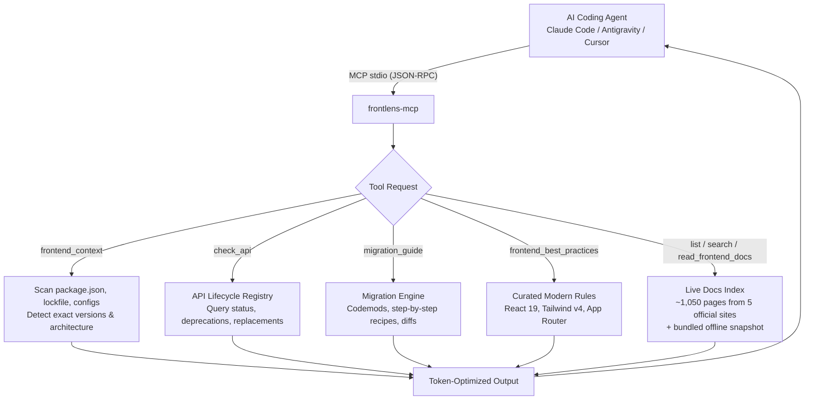

# frontlens-mcp

[](https://www.npmjs.com/package/frontlens-mcp)
[](LICENSE)
[](https://nodejs.org)
[](https://modelcontextprotocol.io)

Ask an AI coding assistant to build a frontend feature and it will often recall outdated patterns from static training data — using `ReactDOM.render` or `useFormState` in React 19, writing `tailwind.config.js` with `@tailwind` directives in Tailwind CSS v4, or accessing `cookies()` synchronously in Next.js 15+.

**FrontLens MCP** is a [Model Context Protocol](https://modelcontextprotocol.io) server that provides **version-aware frontend engineering intelligence** across the modern TypeScript frontend ecosystem:
- **React & React DOM** (18.x, 19.x)
- **Next.js** (14.x, 15.x, 16.x App Router & Pages Router)
- **Vite** (6.x, 7.x, 8.x)
- **Tailwind CSS** (v3.x, v4.x)
- **TypeScript** (5.x, 6.x, 7.x)

FrontLens inspects the user's project, detects installed versions and architectures, queries API lifecycle deprecations, provides step-by-step migration recipes, and delivers token-efficient documentation slices.

It runs locally over stdio, requires no API keys, and has zero external build steps.

---

## Contents

- [How it works](#how-it-works)
- [Requirements](#requirements)
- [Installation](#installation)
- [Connect it to your editor](#connect-it-to-your-editor)
- [Tools](#tools)
- [Configuration](#configuration)
- [Usage examples](#usage-examples)
- [Testing](#testing)
- [Troubleshooting](#troubleshooting)
- [Related servers](#related-servers)
- [Contributing](#contributing)
- [License](#license)

---

## How it works

FrontLens bridges the gap between your coding agent and rapidly evolving frontend ecosystems:



---

## Requirements

- **Node.js 20 or later** — verify with `node --version`
- An MCP client: **Claude Code**, **Antigravity**, **Cursor**, **Windsurf**, **Claude Desktop**, etc.
- No API key, account, or database required.

---

## Installation

### Option A — npx (recommended)

No pre-installation needed. Point your MCP client directly at `npx -y frontlens-mcp` and it will automatically execute.

### Option B — global install

```bash
npm install -g frontlens-mcp
frontlens-mcp --version
```

### Option C — local clone

```bash
git clone https://github.com/ajaymahato431/frontlens-mcp.git
cd frontlens-mcp
npm install
npm test
```

---

## Connect it to your editor

### Claude Code

Add FrontLens to your project or global Claude Code configuration:

```bash
claude mcp add frontlens -- npx -y frontlens-mcp
```

Or in your project's `.claude.json`:

```json
{
  "mcpServers": {
    "frontlens": {
      "command": "npx",
      "args": ["-y", "frontlens-mcp"]
    }
  }
}
```

### Google Antigravity / Gemini

Add to your `mcp_config.json` (or `.gemini/config/mcp_config.json`):

```json
{
  "mcpServers": {
    "frontlens": {
      "command": "npx",
      "args": ["-y", "frontlens-mcp"]
    }
  }
}
```

### Cursor

Go to **Settings** → **Features** → **MCP** → **Add New MCP Server**:
- **Name**: `frontlens`
- **Type**: `command`
- **Command**: `npx -y frontlens-mcp`

### Claude Desktop

Edit your `claude_desktop_config.json`:

```json
{
  "mcpServers": {
    "frontlens": {
      "command": "npx",
      "args": ["-y", "frontlens-mcp"]
    }
  }
}
```

---

### Cline / Roo (VS Code)

Edit `cline_mcp_settings.json` via **MCP Servers → Configure**, using the same block.

### Running from a local clone

```json
{
  "mcpServers": {
    "frontlens": {
      "command": "node",
      "args": ["/path/to/frontlens-mcp/index.js"]
    }
  }
}
```

Use the full path to your clone. On Windows either escape the backslashes
(`"C:\path\to\frontlens-mcp\index.js"`) or use forward slashes.

### Pointing it at a specific project

By default `frontend_context` inspects the directory the server was started in.
Set `--project-dir` (or `FRONTLENS_PROJECT_DIR`) when your editor's working
directory is not the project you want inspected — a monorepo root, for instance.
Any tool call can still override it by passing `projectPath`.

---

## Tools

FrontLens exposes 7 tools designed for token efficiency.

The documentation tools read the **official sources directly** — react.dev's own
navigation, nextjs.org's markdown, the Vite, Tailwind and TypeScript
repositories — which is roughly 1,050 pages, fetched on demand and cached. A
bundled snapshot ships with the package, so the server still answers when a
documentation site is unreachable, and says which copy it served.

### 1. `frontend_context`
Deeply inspects the current project directory or an explicit path:
- Detects frameworks (`Next.js`, `Vite`, `React`, etc.)
- Resolves exact installed versions from `package-lock.json` or `node_modules`
- Detects configuration files (`vite.config.ts`, `next.config.js`, `tailwind.config.js`, `tsconfig.json`)
- Identifies architecture: Next.js App Router vs Pages Router, Tailwind v3 vs v4 CSS-first setup
- Generates actionable version advisories (e.g. React 19 form hooks, Next.js async cookies).

### 2. `check_api`
Checks the lifecycle status of an API symbol across frameworks:
- **Status**: `current`, `deprecated`, `removed`, or `new`
- Shows introduction, deprecation, and removal version numbers
- Returns direct replacement code snippets (before and after)
- Pass `version` to get the status **as of that version** — `render` is reported as
  deprecated in React 18 and removed in 19, rather than always as removed
- Examples: `render` (`react-dom`), `useFormState` (`react-dom`), `cookies` (`next`), `@theme` (`tailwindcss`).

### 3. `migration_guide`
Provides comprehensive upgrade instructions and breaking changes:
- `tailwind` (3 -> 4)
- `react` (18 -> 19)
- `nextjs` (14 -> 15/16)
- Includes automated codemods (e.g. `npx @tailwindcss/upgrade`, `@next/codemod`) and code diffs.

### 4. `frontend_best_practices`
Returns curated, modern rules of thumb with Do's and Don'ts and verified code snippets:
- `react-actions`: Form handling with `useActionState` and `useFormStatus`
- `react-effects`: Avoiding unnecessary `useEffect`
- `react-refs`: Direct `ref` prop passing in React 19
- `next-server-components`: Structuring Server and Client Component boundaries
- `next-data-fetching`: Async request APIs and server data patterns
- `tailwind-theme`: CSS-first tokens with `@theme` in v4
- `tailwind-responsive`: Container queries and responsive design
- `vite-config`: Modern Vite plugin setup and environment variables
- `typescript-modern`: `moduleResolution: bundler`, `verbatimModuleSyntax`, `satisfies`

### 5. `list_frontend_docs`
Browses the documentation index — start here when exploring:
- No arguments returns a per-framework summary (~60 tokens).
- `framework: "react"` lists that framework's categories.
- `framework` + `category` lists pages, with `limit` and `offset` for paging.

### 6. `search_frontend_docs`
Searches all five documentation sets at once:
- Keyword queries with an optional `framework` filter
- Returns ranked pages with their framework, category and path
- Optional `includeContent: true` returns the top match's content immediately.

### 7. `read_frontend_docs`
Reads one documentation page from its official source:
- `outline: true` returns only the headings (~50 tokens) so you can pick a section cheaply.
- `section: "Parameters"` extracts just that heading (~100–300 tokens) instead of
  dumping a whole page into the model's context.
- Every response names the URL it was served from, so freshness is never ambiguous.

---

## Configuration

All configuration is optional — FrontLens runs with sensible defaults out of the box.

Precedence: **CLI flag > environment variable > built-in default**.

| Option | CLI Flag | Environment Variable | Default | Description |
| --- | --- | --- | --- | --- |
| Project Dir | `--project-dir <path>` | `FRONTLENS_PROJECT_DIR` | `""` (cwd) | Default directory to inspect |
| Timeout | `--timeout <ms>` | `REQUEST_TIMEOUT_MS` | `15000` | HTTP fetch timeout in milliseconds |
| Retries | `--retries <n>` | `REQUEST_RETRIES` | `2` | Retry attempts for transient upstream failures |
| Cache Size | `--cache-max <n>` | `CACHE_MAX_ENTRIES` | `100` | Maximum cached documents in memory |
| Doc TTL | `--doc-ttl <ms>` | `DOC_TTL_MS` | `10800000` (3h) | Cache lifetime for documentation pages |
| Index TTL | `--index-ttl <ms>` | `INDEX_TTL_MS` | `21600000` (6h) | Cache lifetime for documentation index |
| Negative TTL | `--negative-ttl <ms>` | `NEGATIVE_TTL_MS` | `60000` (1m) | How long a failed fetch is remembered |
| Max Results | `--max-results <n>` | `SEARCH_MAX_RESULTS` | `5` | Default number of search results |
| GitHub Token | *(secret)* | `GITHUB_TOKEN` | `""` | Optional token to raise GitHub rate limits |

---

### Using a `.env` file

```bash
cp .env.example .env
```

Edit it and restart. A missing `.env` is not an error — every value has a
default. Variables already set in the environment (including your MCP client's
`env` block) always win over the file.

`.env` is git-ignored. Only `.env.example`, which contains no secrets, is
committed.

### About `GITHUB_TOKEN`

No credential is required. The token is optional and only affects two of the five
frameworks: Tailwind CSS and TypeScript publish no sitemap, so their indexes come
from GitHub's API. That is **one request each per index TTL** (6 hours by
default), which fits comfortably in the 60-per-hour anonymous limit. Set a token
only if you hit a rate limit — on a shared or heavily NAT'd network, for example.

React, Next.js and Vite indexes never touch the GitHub API.

### Why there is no Dockerfile

This server is launched as a subprocess by your editor and talks over stdio; it
is not a long-running service. A container would add a process boundary and
startup cost without providing isolation your editor does not already have.
`npx` is the intended distribution.

---

## Usage examples

**Ask an agent:**
> "Inspect our frontend project and check if our dependencies have any deprecated APIs."

The agent calls `frontend_context` → detects React 19 and Tailwind v4 → calls `check_api` for any suspect imports.

**Ask an agent:**
> "How do I upgrade this Tailwind 3 project to Tailwind 4?"

The agent calls `migration_guide` with `framework: "tailwind", from: "3", to: "4"` → receives the exact codemod and CSS migration steps.

**Ask an agent:**
> "What's the best way to handle forms in React 19?"

The agent calls `frontend_best_practices` with `topic: "react-actions"` → receives `useActionState` and `useFormStatus` code examples.

**Ask an agent:**
> "We're still on React 18 — is `ReactDOM.render` safe to keep using for now?"

The agent calls `check_api` with `name: "render", package: "react-dom", version: "18.0.0"`
→ deprecated but still present in 18, removed in 19. It leaves the working code
alone and flags it for the upgrade instead of rewriting it now.

**Ask an agent:**
> "Read me the parameters section of the useActionState docs."

The agent calls `search_frontend_docs` → gets `react/reference/react/useActionState`
→ calls `read_frontend_docs` with `section: "Parameters"` → receives a few hundred
tokens from react.dev instead of the whole page.

---

## Testing

FrontLens uses Node's native test runner (`node:test`). The unit suite is fully
offline — the framework adapters are driven by fixtures in `test/fixtures/` — so
it never fails because a documentation site is down. The integration suite spawns
the server over stdio and does hit the live sites, which is why CI runs it in a
separate, non-blocking job.

```bash
# Run offline unit tests
npm test

# Run stdio MCP protocol integration tests
npm run test:integration

# Run all tests
npm run test:all
```

---

## Troubleshooting

**`npx` says the package is not found**

The package must be published before `npx frontlens-mcp` resolves. Until then,
run it [from a local clone](#running-from-a-local-clone).

**The server does not appear in my editor**

Restart the editor after editing its MCP config — most clients read it only at
startup. Then check the client's MCP log; a JSON syntax error in the config is by
far the most common cause, and the server never gets launched at all.

**`env: node
: No such file or directory` (Linux/macOS)**

The `index.js` shebang was checked out with CRLF line endings. `.gitattributes`
pins LF and the test suite asserts it, so this should only happen with an
unusually configured git client. Re-clone with `core.autocrlf=input`.

**A tool reports "Served from the bundled snapshot"**

One of the five documentation sites could not be reached, so that framework was
answered from the copy shipped in the package. The message names the framework
and the reason. Everything still works; the pages are just as fresh as the last
release rather than current.

If it says *rate-limited*, it will be Tailwind or TypeScript — those two index
through GitHub's API. Set `GITHUB_TOKEN` (see
[About `GITHUB_TOKEN`](#about-github_token)).

**`read_frontend_docs` says the page does not exist**

Paths come from the live index, so they change when upstream reorganises its
docs. Use `search_frontend_docs` or `list_frontend_docs` to get a current path
rather than typing one from memory.

**Responses are slower than expected on the first call**

The first documentation call builds the index from five upstreams — normally
about a second. It is then cached for `--index-ttl` (6 hours), so subsequent
calls are served from memory. Raise `--timeout` on a slow or filtered network.

---

## Related servers

Built on the same core, for the rest of the stack:

- [django-mcp](https://github.com/ajaymahato431/django-mcp) — Django documentation
- [filament-mcp](https://github.com/ajaymahato431/filament-mcp) — Filament documentation
- [livewire-mcp](https://github.com/ajaymahato431/livewire-mcp) — Livewire documentation

---

## Contributing

Contributions are welcome! Please ensure:
- All unit and integration tests pass (`npm run test:all`).
- The shared `src/core/` modules stay synchronized with sibling repositories.
- Tool outputs remain concise and token-efficient.

See [CONTRIBUTING.md](CONTRIBUTING.md) for details.

---

## License

[MIT](LICENSE) © 2026 Ajay Mahato
