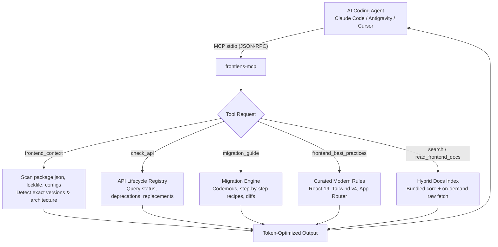

# frontlens-mcp

[](https://www.npmjs.com/package/frontlens-mcp)
[](LICENSE)
[](https://nodejs.org)
[](https://modelcontextprotocol.io)

Ask an AI coding assistant to build a frontend feature and it will often recall outdated patterns from static training data — using `ReactDOM.render` or `useFormState` in React 19, writing `tailwind.config.js` with `@tailwind` directives in Tailwind CSS v4, or accessing `cookies()` synchronously in Next.js 15+.

**FrontLens MCP** is a [Model Context Protocol](https://modelcontextprotocol.io) server that provides **version-aware frontend engineering intelligence** across the modern TypeScript frontend ecosystem:
- **React & React DOM** (18.x, 19.x)
- **Next.js** (14.x, 15.x, 16.x App Router & Pages Router)
- **Vite** (6.x, 7.x, 8.x)
- **Tailwind CSS** (v3.x, v4.x)
- **TypeScript** (5.x, 6.x, 7.x)

FrontLens inspects the user's project, detects installed versions and architectures, queries API lifecycle deprecations, provides step-by-step migration recipes, and delivers token-efficient documentation slices.

It runs locally over stdio, requires no API keys, and has zero external build steps.

---

## Contents

- [How it works](#how-it-works)
- [Requirements](#requirements)
- [Installation](#installation)
- [Connect it to your editor](#connect-it-to-your-editor)
- [Tools](#tools)
- [Configuration](#configuration)
- [Usage examples](#usage-examples)
- [Testing](#testing)
- [Contributing](#contributing)
- [License](#license)

---

## How it works

FrontLens bridges the gap between your coding agent and rapidly evolving frontend ecosystems:



---

## Requirements

- **Node.js 20 or later** — verify with `node --version`
- An MCP client: **Claude Code**, **Antigravity**, **Cursor**, **Windsurf**, **Claude Desktop**, etc.
- No API key, account, or database required.

---

## Installation

### Option A — npx (recommended)

No pre-installation needed. Point your MCP client directly at `npx -y frontlens-mcp` and it will automatically execute.

### Option B — global install

```bash
npm install -g frontlens-mcp
frontlens-mcp --version
```

### Option C — local clone

```bash
git clone https://github.com/ajaymahato431/frontlens-mcp.git
cd frontlens-mcp
npm install
npm test
```

---

## Connect it to your editor

### Claude Code

Add FrontLens to your project or global Claude Code configuration:

```bash
claude mcp add frontlens -- npx -y frontlens-mcp
```

Or in your project's `.claude.json`:

```json
{
  "mcpServers": {
    "frontlens": {
      "command": "npx",
      "args": ["-y", "frontlens-mcp"]
    }
  }
}
```

### Google Antigravity / Gemini

Add to your `mcp_config.json` (or `.gemini/config/mcp_config.json`):

```json
{
  "mcpServers": {
    "frontlens": {
      "command": "npx",
      "args": ["-y", "frontlens-mcp"]
    }
  }
}
```

### Cursor

Go to **Settings** → **Features** → **MCP** → **Add New MCP Server**:
- **Name**: `frontlens`
- **Type**: `command`
- **Command**: `npx -y frontlens-mcp`

### Claude Desktop

Edit your `claude_desktop_config.json`:

```json
{
  "mcpServers": {
    "frontlens": {
      "command": "npx",
      "args": ["-y", "frontlens-mcp"]
    }
  }
}
```

---

## Tools

FrontLens exposes 6 specialized tools designed for token efficiency:

### 1. `frontend_context`
Deeply inspects the current project directory or an explicit path:
- Detects frameworks (`Next.js`, `Vite`, `React`, etc.)
- Resolves exact installed versions from `package-lock.json` or `node_modules`
- Detects configuration files (`vite.config.ts`, `next.config.js`, `tailwind.config.js`, `tsconfig.json`)
- Identifies architecture: Next.js App Router vs Pages Router, Tailwind v3 vs v4 CSS-first setup
- Generates actionable version advisories (e.g. React 19 form hooks, Next.js async cookies).

### 2. `check_api`
Checks the lifecycle status of an API symbol across frameworks:
- **Status**: `current`, `deprecated`, `removed`, or `new`
- Shows introduction, deprecation, and removal version numbers
- Returns direct replacement code snippets (before and after)
- Examples: `render` (`react-dom`), `useFormState` (`react-dom`), `cookies` (`next`), `@theme` (`tailwindcss`).

### 3. `migration_guide`
Provides comprehensive upgrade instructions and breaking changes:
- `tailwind` (3 -> 4)
- `react` (18 -> 19)
- `nextjs` (14 -> 15/16)
- Includes automated codemods (e.g. `npx @tailwindcss/upgrade`, `@next/codemod`) and code diffs.

### 4. `frontend_best_practices`
Returns curated, modern rules of thumb with Do's and Don'ts and verified code snippets:
- `react-actions`: Form handling with `useActionState` and `useFormStatus`
- `react-effects`: Avoiding unnecessary `useEffect`
- `react-refs`: Direct `ref` prop passing in React 19
- `next-server-components`: Structuring Server and Client Component boundaries
- `next-data-fetching`: Async request APIs and server data patterns
- `tailwind-theme`: CSS-first tokens with `@theme` in v4
- `tailwind-responsive`: Container queries and responsive design
- `vite-config`: Modern Vite plugin setup and environment variables
- `typescript-modern`: `moduleResolution: bundler`, `verbatimModuleSyntax`, `satisfies`

### 5. `search_frontend_docs`
Searches official documentation across React, Next.js, Vite, Tailwind CSS, and TypeScript:
- Supports keyword queries with optional `framework` filter
- Returns token-efficient page summaries and navigation paths
- Optional `includeContent: true` returns top match content immediately.

### 6. `read_frontend_docs`
Reads an authoritative documentation page:
- `outline: true` returns only the headings outline (~50 tokens) to explore structure cheaply.
- `section: "Heading Name"` extracts only the requested section (~100-300 tokens) instead of dumping thousands of tokens into model context.

---

## Configuration

All configuration is optional — FrontLens runs with sensible defaults out of the box.

Precedence: **CLI flag > environment variable > built-in default**.

| Option | CLI Flag | Environment Variable | Default | Description |
| --- | --- | --- | --- | --- |
| Project Dir | `--project-dir <path>` | `FRONTLENS_PROJECT_DIR` | `""` (cwd) | Default directory to inspect |
| Timeout | `--timeout <ms>` | `REQUEST_TIMEOUT_MS` | `15000` | HTTP fetch timeout in milliseconds |
| Retries | `--retries <n>` | `REQUEST_RETRIES` | `2` | Retry attempts for transient upstream failures |
| Cache Size | `--cache-max <n>` | `CACHE_MAX_ENTRIES` | `100` | Maximum cached documents in memory |
| Doc TTL | `--doc-ttl <ms>` | `DOC_TTL_MS` | `10800000` (3h) | Cache lifetime for documentation pages |
| Index TTL | `--index-ttl <ms>` | `INDEX_TTL_MS` | `21600000` (6h) | Cache lifetime for documentation index |
| Negative TTL | `--negative-ttl <ms>` | `NEGATIVE_TTL_MS` | `60000` (1m) | How long a failed fetch is remembered |
| Max Results | `--max-results <n>` | `SEARCH_MAX_RESULTS` | `5` | Default number of search results |
| GitHub Token | *(secret)* | `GITHUB_TOKEN` | `""` | Optional token to raise GitHub rate limits |

---

## Usage examples

**Ask an agent:**
> "Inspect our frontend project and check if our dependencies have any deprecated APIs."

The agent calls `frontend_context` → detects React 19 and Tailwind v4 → calls `check_api` for any suspect imports.

**Ask an agent:**
> "How do I upgrade this Tailwind 3 project to Tailwind 4?"

The agent calls `migration_guide` with `framework: "tailwind", from: "3", to: "4"` → receives the exact codemod and CSS migration steps.

**Ask an agent:**
> "What's the best way to handle forms in React 19?"

The agent calls `frontend_best_practices` with `topic: "react-actions"` → receives `useActionState` and `useFormStatus` code examples.

---

## Testing

FrontLens includes an offline unit test suite and a live stdio integration test suite using Node's native test runner (`node:test`):

```bash
# Run offline unit tests
npm test

# Run stdio MCP protocol integration tests
npm run test:integration

# Run all tests
npm run test:all
```

---

## Contributing

Contributions are welcome! Please ensure:
- All unit and integration tests pass (`npm run test:all`).
- The shared `src/core/` modules stay synchronized with sibling repositories.
- Tool outputs remain concise and token-efficient.

See [CONTRIBUTING.md](CONTRIBUTING.md) for details.

---

## License

[MIT](LICENSE) © 2026 Ajay Mahato
